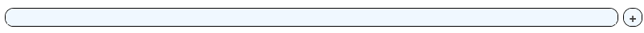
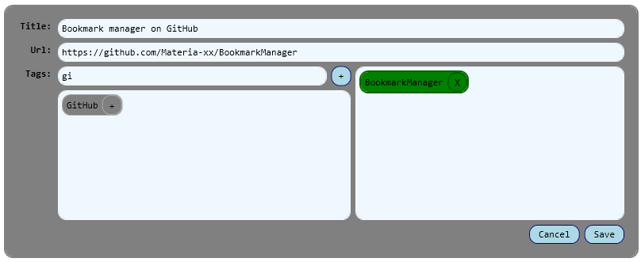
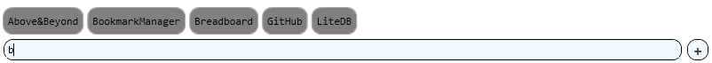
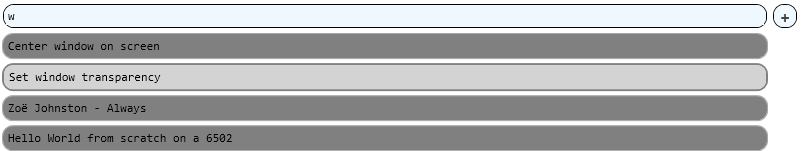
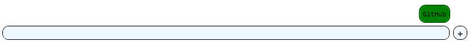
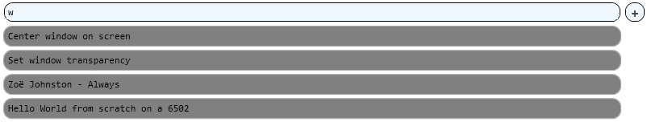
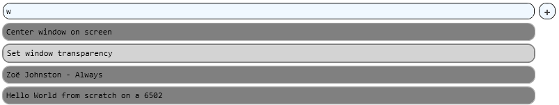

# BookmarkManager
Manage URL bookmarks in a tag based format.

# Overview
Build the program using Visual Studio 2017 or other compatabile compiler.

Running the program you will first see an empty search box.

Pressing Esc from here will hide the search box. Pressing the activation hotkey (CTRL-SHIFT-X) will bring it back.

### Adding Bookmarks

To add a new bookmark, press the "+" button to the right of the search box and fill in the details.

Note that if you have a url already copied it will be pre-filled here.

The tags textbox serves two functions
* Searches for tags that have been added to other bookmarks. These suggested tags are displayed in the left bottom section. (Shown with the GitHub pill in the example.) You can press the "+" on any pill to move it from the suggestions to the chosen tags for the current bookmark.
* Allows tags that are not already in the database to be added. Press the "+" button to the right of the search textbox to add what you have typed as a chosen tag.

The chosen tags are displayed in the bottom right section. These tags can be removed by pressing the "X" on each pill.

After you have a few bookmarks saved, the main search box can now be used to search for them.

### Searching

After typing a keyword, tag suggestions will appear on the top left. (Only the last word typed is used for this.)

Pressing tab/shift-tab cycles through the suggested tags.

Pressing space will move the highlighted suggested tag to the chosen tags on the right.

Once a tag is chosen, any search results will be ones that contain this tag.

Other terms that are typed in the searchbox, but not chosen as a tag are used to search against the title of the bookmark.

Pressing up/down arrows cycles through the bookmark results.

Pressing return after you have a bookmark selected will open that bookmark and hide the search window.

Bookmarks are opened in your default web browser.

### Editing / Deleting bookmarks

Right click on a serach result to edit or delete it.

### Where are the bookmarks stored?

The bookmarks are stored in a database file "bookmark.db" located next to the exe. This file is created when the program first starts.
